<!---

    

    

-->

  

<!---

    
View my Github insights
-->

<!---<table align="center">
   <tbody>
       <tr>
           <td></td>
           <td></td>
       </tr>
       <tr>
        <td></td>
         <td></td>
       </tr>
       <tr>
         <td></td>
         <td></td>
       </tr>
       <tr>
        <td></td>
        <td></td>
       </tr>
   </tbody>
</table>-->

    

        
<!---

-->
<!---
-->
<!---

    

-->
<!---
-->
<!---

- 🌐 Visit my [Website](https://mnvsm.vercel.app/)
- 💻 View my [HackerRank](https://www.hackerrank.com/manav_sm)
- 👔 Connect with me on [LinkedIn](https://www.linkedin.com/in/manavsm/)

<!---](mailto:contact@rehkloos.com)

    

    

Welcome to my profile! 
I’m Manav Sandeep Mehta, an IT Engineering Graduate, Developer from Mumbai. I am currently working as a Support Engineer at ANV Infotech Pvt. Ltd.
- 🌐 Visit my [Website](https://mnvsm.pages.dev/)
- 💻 View my [HackerRank](https://www.hackerrank.com/manav_sm)
- 📬 Send me an [Email](mailto:Manav-SM@outlook.com)
- 🔭 Support Engineer at ANV Infotech Pvt. LTd.
- 👔 Connect with me on [LinkedIn](https://www.linkedin.com/in/manavsm/)
- 🎓 IT Engineering Graduate from [Shah and Anchor Kutchhi Engineering College](https://www.shahandanchor.com/home/)
- 🏡 Based in Mumbai, India

## Technologies I have uses

### Languages

### Software

    

-->

<!---📫 How to reach me: ...

**Manav-SM/Manav-SM** is a ✨ _special_ ✨ repository because its `README.md` (this file) appears on your GitHub profile.

Here are some ideas to get you started:

- 🔭 I’m currently working on ...
- 🌱 I’m currently learning ...
- 👯 I’m looking to collaborate on ...
- 🤔 I’m looking for help with ...
- 💬 Ask me about ...
- 📫 How to reach me: ...
- 😄 Pronouns: ...
- ⚡ Fun fact: ...

🏡 [website][website] **|**
🐦 [twitter][twitter] **|**
📺 [youtube][youtube] **|**
🎥 [twitch][twitch] **|**
📦 [npm][npm] **|**
📷 [instagram][instagram] **|**
👔 [linkedin][linkedin]

[website]: https://mnvsm.pages.dev/
[twitter]: https://github.com/
[youtube]: https://github.com/
[twitch]: https://github.com/
[instagram]: https://github.com/
[linkedin]: https://github.com/
[npm]: https://github.com/
[brad]: https://github.com/
-->
